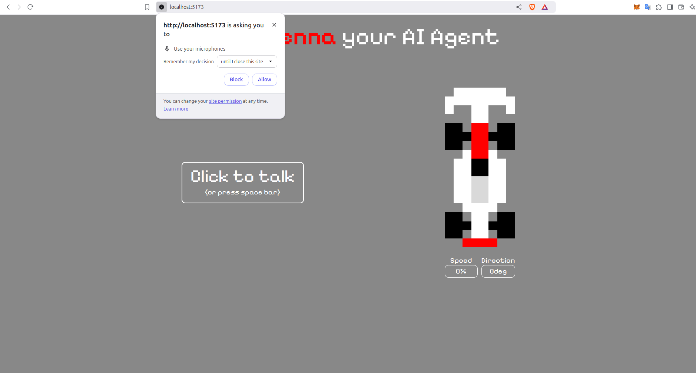

Senna AI
===========================


This project implements an artificial intelligence agent based on Gemini, which allows controlling a car using voice commands. Through natural language processing (NLP) and speech recognition, the agent interprets commands and translates them into physical actions, such as accelerating, turning or stopping the vehicle.



## Prerequisites

Before you begin, make sure you meet the following requirements:

- [Yarn](https://www.npmjs.com/package/yarn)

## Instructions to Run

```
git clone https://github.com/Luan-Web3/senna-ai.git
```

```
cd senna-ai
```
- Duplicate the `.env.example` file and rename it to `.env`
```
yarn install
```
```
yarn run dev
```
The application will be available at http://localhost:5173

## License

<sup>
Licensed under either of <a href="LICENSE-APACHE">Apache License, Version
2.0</a> or <a href="LICENSE-MIT">MIT license</a> at your option.
</sup>

<br>

<sub>
Unless you explicitly state otherwise, any contribution intentionally submitted
for inclusion in this crate by you, as defined in the Apache-2.0 license, shall
be dual licensed as above, without any additional terms or conditions.
</sub>